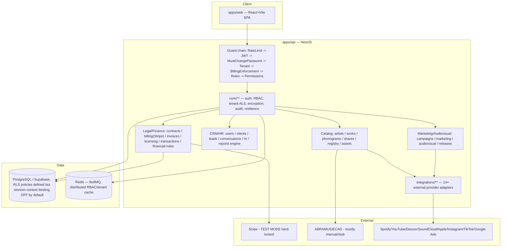

# Codebase Map

> Auto-generated by Cartographer (controlled batch run) in a disposable worktree, then reconciled and handed off into the canonical `dev` branch. Last mapped: 2026-09-14T09:42:09Z
> Scanner: 3,409 files / 4,694,065 tokens / 14 skipped (binary/oversized). 25 token-balanced Explore groups, dispatched in batches of 5 concurrent read-only Sonnet subagents.

> **Handoff provenance:** The Cartographer worktree's mapped HEAD (`2c36f2bc56ad1e59b8ca55dbf45d15b3d66c0f87`) is **identical** to canonical `dev`'s HEAD at handoff time — zero commit delta, so no staleness reconciliation against intervening commits was needed. All structural/architectural statements below are classified `CURRENT_AND_CONFIRMED` on that basis. The numbered "findings"/"Gotchas" throughout this document remain Cartographer's own prose assessment — real repository intelligence, but **not** independently proven via this repo's evidence-governance process (`.claude/rules/evidence-governance.md`) the way a dispositioned `.claude/ops/state.json` finding is. They are classified `FINDING_REQUIRES_LATER_EXECUTION`: treat them as high-quality leads for the domain-specific audit skills to formally confirm or refute, not as confirmed defects. One correction was applied during handoff (see the annotation on Gotcha #1 below) after a direct spot-check against the current `.env.*` files.

## Region Analysis Progress

| # | Group | Scope | Est. tokens | Status |
|---|-------|-------|-------------|--------|
| 1 | api-catalog-core | apps/api/src/modules/{artists,works,phonograms,shares,registry,assets} | 206k | done |
| 2 | api-integrations-marketing-releases | apps/api/src/modules/{integrations,marketing,campaigns,releases,audiovisual,content-detections,ecad-reports} | 164k | done |
| 3 | api-legal-billing-contracts-financial | apps/api/src/modules/{billing,contracts,invoices,licensing,contract-templates,contract-service-types,financial,financial-categories,finance-category-rules,financial-rules,transactions,takedowns} | 154k | done |
| 4 | api-crm-hr-users-reports | apps/api/src/modules/{users,clients,leads,lead-interactions,contacts,contact-attachments,contact-timeline,contact-contracts,internal-chat,support-tickets,support-requests,hr,conversations,knowledge-base,platform-contact,admin-users,briefings,reports,analytics,artist-goals,audit-log,activity-logs} | 203k | done |
| 5 | api-core-platform | apps/api/src/core/** | 189k | done |
| 6 | api-database-support-misc | apps/api/src/database/** (excl. migrations), src/queues, modules/{notifications,uploads,health,rbac,company-settings,operational-lists,events,projects,auth}, ownership-prechecks.spec.ts, repositories-tenant-isolation.spec.ts | 156k | done |
| 7 | api-migrations-part1 | apps/api/src/database/migrations/2024*..20260719000002* (chronological first half) | 147k | done |
| 8 | api-migrations-part2 | apps/api/src/database/migrations/20260719000003*..present + index.ts (canonical-form-order rebuild onward) | 144k | done |
| 9 | api-scripts-drizzle | apps/api/scripts/**, apps/api/drizzle/** | 191k | done |
| 10 | api-test-root-config | apps/api/test/**, apps/api root sql/config files (migrations-complete.sql, supabase-rls.sql, seed*, jest configs, Dockerfile, etc.) | 72k | done |
| 11 | web-marketing-dashboard | apps/web/src/modules/{marketing,dashboard} | 188k | done |
| 12 | web-accounting-financial | apps/web/src/modules/{accounting,licensing,reports} | 132k | done |
| 13 | web-artist-catalog-audiovisual | apps/web/src/modules/{artist,catalog,audiovisual} | 177k | done |
| 14 | web-contracts-releases-projects | apps/web/src/modules/{contracts,releases,projects} | 160k | done |
| 15 | web-integrations-admin-settings | apps/web/src/modules/{integrations,settings,admin} | 193k | done |
| 16 | web-crm-leads-support-events | apps/web/src/modules/{leads,crm-relationships,support,events} | 136k | done |
| 17 | web-comms-monitoring-hr-misc | apps/web/src/modules/{musicchat,monitoring,rh,musicchat-interno,workspace,inventory,auth} | 148k | done |
| 18 | web-shared-ui | apps/web/src/shared/** | 201k | done |
| 19 | web-app-shell-test | apps/web/src/app/**, apps/web/src/test/**, apps/web root (App.tsx, main.tsx, index.css, ARCHITECTURE.md, vite/tailwind/tsconfig) | 71k | done |
| 20 | shared-infra-packages-cicd | packages/**, root scripts/**, .github/**, e2e/**, root reports/**, supabase/**, infra/**, server/**, root config (docker-compose*, package.json, turbo.json, pnpm-workspace.yaml) | 143k | done |
| 21 | claude-governance-ops | .claude/** (ops, runtime, skills, agents, contracts, policies, rules, workflows) | 284k | done |
| 22 | docs-backendv2-traceability-inventory | docs/backend-v2/{field-traceability,database-inventory,gap-resolution}/** | 493k | done |
| 23 | docs-backendv2-numbered-specs | docs/backend-v2/*.md (numbered decision/spec docs, 00-81) | 400k | done |
| 24 | docs-product-tasks | docs/product-tasks/** | 119k | done |
| 25 | docs-root-narrative-runbooks-security | docs/*.md root narrative docs + docs/{runbooks,engineering,adr,legacy}/** (BLUEPRINT*, GOVERNANCE, AUTH/RBAC/TENANT_AUTH architecture, RLS_AND_TENANT_ISOLATION_MATRIX, NAMING_NORMALIZATION_*, runbooks) | 184k | done |

## System Overview

MUSIC OS 360 is a multi-tenant SaaS platform for music-rights/royalty management: catalog (artists, works, phonograms, rights registration to Brazilian collecting societies), contracts/billing/finance, marketing/audiovisual production, CRM/HR, and platform integrations (streaming/social/ads/e-signature). Backend: NestJS + TypeORM + PostgreSQL (Supabase), BullMQ for async jobs. Frontend: React 18 + Vite + TanStack Query. Entities are centralized in one file (`apps/api/src/database/entities.ts`, ~3700 lines) rather than per-module — module-local `entities/*.entity.ts` files that also exist across ~8+ modules (integrations, releases, campaigns, content-detections, ecad-reports, contracts, billing, works, phonograms, shares, audit-log) are **dead stub scaffolding** (3-column classes, never registered/injected) left over from an abandoned per-module-entity convention; always trust `database/entities.ts` as the schema source of truth.



## Directory Structure

- `apps/api/src/modules/**` — ~55 business modules, one directory per bounded domain (see Module Guide).
- `apps/api/src/core/**` — security/platform backbone shared via `@Global()` modules: auth, RBAC, tenant context (AsyncLocalStorage), encryption, audit, resilience, guards/interceptors/filters. See Security Boundaries below.
- `apps/api/src/database/**` — `entities.ts` (all TypeORM entities), `migrations/` (210 files), tenant bootstrap/context services, RLS-related session helpers.
- `apps/api/src/queues/**` — BullMQ queue definitions.
- `apps/web/src/modules/**` — ~25 frontend feature modules mirroring backend domains (mapped in later batches).
- `.claude/**` — an elaborate engineering-governance framework (rules, ops runtime, agents) layered on top of this repo for AI-assisted development discipline; not part of the product runtime.

## Module Guide

### Catalog domain: artists, works, phonograms, shares, registry, assets

Core relational shape (app-enforced, **no physical DB foreign keys** on `artist_id`/`work_id`/`fonograma_id` — integrity is via `assertSameTenantFk()` utility, not FK constraints):

```
ArtistEntity --1:N--> WorkEntity, PhonogramEntity, ContractEntity, ReleaseEntity
WorkEntity   --1:N--> PhonogramEntity, ShareEntity, WorkParticipantEntity(CASCADE, free-text, not FK'd to artists)
ShareEntity  -- dual-purpose: registry splits (share_type IS NULL) vs financial/pending shares (share_type set)
RegistryModule -- cross-cutting: validates works/phonograms/shares, builds ABRAMUS/ECAD submission payloads
AssetsModule -- central file/media registry, polymorphically linked to projects/tasks; not itself an uploader
```

- **Artists** (`modules/artists/`): `ArtistEntity` — encrypted PII (email/phone/CPF via `EncryptionService`), social platform URLs, plus a platform-profile sub-domain (`ArtistPlatformProfileEntity`, append-only `ArtistMetricSnapshotEntity`, `CareerStageSnapshotEntity`, `MarketBenchmarkSnapshotEntity`) fed by `SoundchartsService`. Status transitions have business rules (e.g. `SIGNED` requires `contrato_id`). SQL-injection fix applied to `orderBy` via an explicit allow-list (`safeOrderBy`). Emits `ARTIST_CREATED/UPDATED/STATUS_CHANGED/DELETED`; consumed by automation that bootstraps default `ArtistGoalEntity` rows.
- **Works** (`modules/works/`): `WorkEntity` — ISRC/ISWC, `compositores` jsonb denormalized from normalized `WorkParticipantEntity` child table. "Create work" flow: validate `artist_id` tenant match → normalize/validate ISRC (via **registry module's** validators, a confirmed cross-module dependency) → insert work + participants in one transaction (fixed an "orphan work" bug) → emit `CATALOG_WORK_CREATED` → AI catalog-metadata-validation automation runs async, non-blocking.
- **Phonograms** (`modules/phonograms/`): `PhonogramEntity` — recordings, same ISRC validation logic **duplicated inline** (not shared via the same helper as Works). `assertSameTenantFk` on `work_id`/`artist_id`.
- **Shares** (`modules/shares/`): dual-purpose `ShareEntity`. Registry-eligible split percentages must not exceed 100% (`SPLIT_TOLERANCE=0.01`), enforced under a **Postgres advisory transaction lock** (`pg_advisory_xact_lock`) to close a real race condition (two concurrent creates both reading pre-write sum). `share_type IS NULL` as "is a registry share" is a documented fragile convention with an open TODO.
- **Registry** (`modules/registry/`): validates works/phonograms/shares for society submission (author-share-sums-to-100%, ISRC/ISWC/CPF/CNPJ check-digit validators), immutable versioned payload snapshots, and a submission state machine (DRAFT→VALIDATING→VALID/INVALID→READY→SUBMITTED→APPROVED/REJECTED). **Only the `MANUAL_EXPORT` adapter is functional** — `PartnerApiAdapter`/`PortalRpaAdapter` are explicit disabled-by-default stubs that throw rather than fake success. No live ABRAMUS/ECAD API integration exists anywhere in the codebase.
- **Assets** (`modules/assets/`): file/media registry, created only as a side effect of an `asset.uploaded` event (no direct `POST /assets`); MIME/filename heuristic auto-classification; `ReleaseReadinessService` gates distribution readiness (cover art + WAV master + phonogram + ISRC + metadata present).

Tenant isolation pattern used uniformly: app-layer `tenant_id` filtering + `assertSameTenantFk()` for cross-entity references + DB-layer session variables (`app.current_tenant_id` etc., see Security Boundaries) as defense-in-depth. Dedicated `*-cross-tenant-fk.security.spec.ts` files exist per module, referencing named historical bug IDs (`find-f81eebf2`, `find-1e77a856`, `find-924ed503`, `find-a192e412`) — evidence of a systematic post-audit hardening pass.

### Integrations, Marketing, Releases, Audiovisual, Content-Detections, ECAD-Reports

- **Integrations** (`modules/integrations/`): 14 real provider adapters — ACRCloud (audio fingerprint), Autentique & DocuSign (e-signature), Spotify/YouTube/Deezer/SoundCloud/Apple Music/Instagram/TikTok/Google Ads (platform/ads), Abramus (PRO, re-logs in on every request — no token cache), WhatsApp Cloud (webhook resolves tenant by scanning credential rows), Soundcharts (global/not per-tenant, canonical artist-ID resolver across platforms). Resilience is **inconsistent**: some providers get a shared `CircuitBreakerRegistry` entry, most instantiate their own private breaker, two (Autentique/DocuSign) bypass the breaker pattern entirely. Credentials centralized in `IntegrationEntity`/`OAuthConnectionEntity` (AES-encrypted), governed by a mature capability-registry + policy-resolution layer (`canDiscover/canConnect/canUse`) enforced server-side via `IntegrationUsageGuard`. Google Ads/TikTok Ads never refresh their OAuth access tokens before use (Spotify/Instagram do) — likely a silent-401 gap.
- **Releases** (`modules/releases/`): contrary to earlier suspicion, the *real* `ReleaseEntity` (in `database/entities.ts`) is fully modeled and `ReleasesService` is functionally complete (status workflow via shared `WorkflowService`, optimistic concurrency, domain events) — only the **module-local stub file** is a dead 3-column placeholder. `onReleaseDistributed`/`onReleasePublished` event handlers are genuinely empty no-ops though (real TODO).
- **Campaigns/Marketing**: `CampaignEntity` shared by two features (`campaigns` module CRUD and `marketing`'s `MarketingCampaignBuilderService`, discriminated by `type`). `MarketingCampaignBuilderController`'s `publish()` explicitly **never calls any ad-platform integration** — self-documented as a stub ("Provider-side publishing is not executed"). `MarketingAiSuggestionsService` does not call any LLM despite its name — it just persists caller-supplied JSON. Campaigns lacks optimistic-concurrency (`casUpdate`) on plain field edits, unlike releases/marketing-projects/audiovisual.
- **Audiovisual** (`modules/audiovisual/`): production pipeline (briefing→pre_production→production→post_production→approval→delivered→published) with a **hand-rolled state machine**, not the shared `WorkflowService` used by releases/campaigns/contracts — an inconsistent pattern worth flagging architecturally.
- **Content-Detections / ECAD-Reports**: manual bookkeeping CRUD only. Content-detections has **no wiring to `ACRCloudService`** despite ACRCloud being the platform's only audio-fingerprint provider — detections are entered by hand, not from an automated recognition pipeline. ECAD has no API adapter at all (`NOT_IMPLEMENTED` in the capability registry) — purely manual statement entry.

### Legal / Billing / Contracts / Financial

- **Billing** (`modules/billing/`): SaaS subscription billing. `BillingEnforcementService` is the **single canonical authority** for tenant billing state (`tenant_billing_state` table) — a documented historical bug had `DunningService` and `BillingService` writing tenant status independently, causing incorrect access. Stripe usage is **fully confined to this module** and hard-locked to TEST MODE (`stripe-key-guard.ts` unconditionally rejects `sk_live_`/`pk_live_` keys everywhere). Three-stage dunning escalation (`payment_grace`→`read_only`→`suspended`) via a daily sweep (`setInterval`, not BullMQ cron) using Postgres advisory locks to prevent double-processing.
- **Contracts** (`modules/contracts/`): status workflow (draft→signed→in_force→expired/cancelled) via shared `WorkflowService`, CAS optimistic concurrency, plan-quota enforcement (`PlanLimitService`). On `CONTRACT_SIGNED`, directly creates a provisional revenue `TransactionEntity` — **bypasses `TransactionsService` entirely**, a parallel money-write path.
- **Invoices** (`modules/invoices/`): the `invoices` table is **dual-purpose** — tenant-issued tax invoices (Brazilian NF-e fields) AND Stripe SaaS-subscription invoices (`type` discriminator). A documented privilege-escalation bug (`REM-06`) let a `viewer` read SaaS billing invoices via `/invoices` before a `type != 'stripe_subscription'` filter was added — any future query against this table must remember that filter.
- **Licensing**: `LicenseEntity.percentage` (royalty rate) is persisted but **no code anywhere applies it** — no payout calculation reads it. An isolated leaf module, no event emission.
- **Financial rules / royalty engine**: `FinancialRulesService.evaluateRules()` is the closest thing to a royalty-rate calculator (percentual/fixo/faixa), triggered by `contract.signed`/`transaction.created`/`transaction.paid`/`invoice.overdue` events — but its `'faixa'` (tiered) calculation type is an explicit unimplemented stub, and its output event `FINANCIAL_RULE_TRIGGERED` has **no confirmed listener** anywhere in the codebase. Separately, `financial/domain/largest-remainder.ts` implements a BigInt-precise "largest remainder" percentage-split algorithm explicitly built for a `TransactionAllocations` migration/feature — but it is **referenced only by its own spec file**, orphaned from any real caller. **Net finding: royalty/rate-splitting math and config exist in three separate places (LicenseEntity.percentage, ContractServiceTypeEntity penalty/interest rates, FinancialRulesService + largest-remainder engine) with no confirmed end-to-end wiring from "a rate is configured" to "a payout is computed and recorded."**
- **Transactions**: the general ledger sink. Money precision is inconsistent — `decimal` columns persisted correctly, but rule evaluation and DTO mapping convert through JS `number`/`parseFloat` rather than the BigInt-safe pattern the codebase already knows about (`largest-remainder.ts`).
- Cross-cutting: `casUpdate()` optimistic concurrency, `assertSameTenantFk()`, `IdempotencyInterceptor` + `X-Idempotency-Key` on all money-creating POSTs, domain events with fail-closed tenant-missing handling, and cron schedulers (`ContractExpiryScheduler`, `InvoiceOverdueScheduler`) that discover affected tenants via a bypass-RLS admin connection, then reprocess each one inside proper per-tenant RLS context.

### CRM / HR / Reports

- **Users/Clients/Leads**: `OrgMemberEntity` is the membership/RBAC record (identity itself lives in Supabase Auth). `ClientEntity` is the canonical CRM contact — **`contacts` module is a thin facade over `ClientsService`** (the real `contacts` table was dropped by a migration never present in this repo); `contact-attachments`/`contact-timeline`/`contact-contracts` are **in-memory-only** (`Map`-backed, lost on restart, not shared across instances) and superseded by the real persisted equivalents on `ClientsController`.
- **Reports engine**: genuinely reflection-based (TypeORM `getMetadataArgsStorage()` scan of all entities) but gated by a closed, hand-authored 22-table registry (`report-module-registry.ts`) plus a per-table `ReportFormContract` mapping logical fields to physical storage (column/metadata/encrypted). Export enforces a hard row cap and decrypts encrypted fields at export time; import is transactional and **create-only** (never updates existing rows).
- **Audit trail**: `@Audit('entity.action')` decorator + globally-registered `AuditInterceptor` captures before/after snapshots (before-snapshot lookup via a hardcoded `ENTITY_TABLE_MAP`) and computes a shallow diff — **opt-in per route**, not enforced by a data-layer hook, and all failures are silently swallowed (audit logging can never break the primary operation, but also can silently produce no trail). Distinct from lightweight `activity-logs` (no diffing, user-facing feed).
- **HR**: employees/payroll/leave-requests. Payroll creation is `IdempotencyInterceptor`-protected (prevents double-payment); leave approval uses a conditional `UPDATE...WHERE status='pending'` (not read-then-write) to prevent double-approval races. Only employee master data is reportable — payroll/leave detail are not in the reports registry.
- **Internal-chat vs Conversations**: architecturally isolated (explicit doc comment — "no entity/table/service/identity shared"). `internal-chat` = team-to-team, DB-checked participant membership. `conversations` = external/customer omnichannel inbox (WhatsApp etc.), hosts `musicchat-automation` bot dispatch as a sub-concern.

### Core Platform (`apps/api/src/core/**`) — see Security Boundaries section

### Database & Migrations (`apps/api/src/database/**`, 210 migrations, plus scripts/drizzle/test tooling)

**Connections**: `DatabaseModule` (`@Global`) provides three DataSource tokens — `DATA_SOURCE` (main app connection, `APP_DATABASE_URL` when `DATABASE_SESSION_CONTEXT_ENABLED=true`, else `DATABASE_URL`), `ADMIN_DATA_SOURCE` (always the owner/bypass-RLS connection, used only for cross-tenant enumeration and pre-tenant-context identity resolution — e.g. `TenantBootstrapResolver`), and `PROVISIONING_DATA_SOURCE` (dedicated to first-workspace bootstrap). Tenant-zero (the institutional "LANDER RECORDS" tenant) has a deterministic UUIDv5 identity (`tenant-zero.constants.ts`) and carries **no** special RLS/RBAC/billing privilege — it's an identity constant, not a superuser tenant.

**Tenant-ALS mechanism in detail**: when `DATABASE_SESSION_CONTEXT_ENABLED=true`, `makeTenantAwareDataSource()` (`tenant-als.ts`) wraps the real DataSource in a `Proxy` that re-resolves `getRepository()`/`.manager`/`query`/`transaction` per-call against an `AsyncLocalStorage`-bound `EntityManager` — this is specifically what lets a repository captured once in a service constructor (the normal NestJS DI pattern) still run inside the correct tenant-scoped transaction when invoked later from a queue processor or event handler, without any service-level refactor. `DatabaseContextService.runInTenantContext()` opens a dedicated `QueryRunner`+transaction, issues three `SELECT set_config('app.current_tenant_id'/'app.current_org_id'/'app.current_role', $1, true)` calls (`SET LOCAL`, transaction-scoped, cannot leak across pooled connections), runs the work, commits/rolls back, always releases the runner. **This is explicitly an opt-in, incrementally-adopted primitive** — not every one of 130+ repository call sites is wired through it; only queue processors and specific services (`NotificationsService`, `UploadEventsHandler`, etc.) call it explicitly. When the flag is off (default), `runInTenantContext` is a pure pass-through with zero session-variable binding.

**Migration governance**: `MigrationValidatorService` runs at Nest boot (`OnApplicationBootstrap`, not CI/on-demand) via `ds.showMigrations()`, fatal in production / warn-only in dev, skippable via `SKIP_MIGRATION_CHECK=true`. `migration-classification.ts` categorizes migrations by **schema-object ownership**, not risk level: `APPLICATION` (default, app-owned `public` schema), `EXTERNAL_MANAGED` (currently only the Supabase Realtime broadcast-authorization migration, owned by `supabase_realtime_admin`), `PRIVILEGED` (reserved, currently empty/unused). `migrateApplication()`/`checkApplication()` skip non-APPLICATION migrations rather than aborting the whole linear run. `index.ts` registers exactly the migrations that will actually execute (`ALL_MIGRATIONS`) — two files exist on disk but are **deliberately unregistered** pending human sign-off (`DropOrphanContactsSatelliteTables`, a `PROPOSAL_` draft), confirming the array in `index.ts` is a real governance gate, not just documentation.

**Baseline schema** (`20240101000000_InitialSchema.ts`): establishes the full multi-tenant foundation in one migration — organizations/tenants/org_members/billing, the music-rights core (artists/works/phonograms/contracts/shares/releases/takedowns/content_detections/ecad_reports), CRM/ops, finance, HR, and platform plumbing (support_tickets/notifications/uploads/integrations/oauth_connections/webhook_events/audit_logs). PII fields were suffixed `_encrypted` from day one — encryption-at-rest was an original design decision. No RLS existed yet; tenancy was purely `tenant_id` + app-layer filtering. Only 2 more migrations followed in all of 2024, then a **~23-month gap** until a dense ~9-week burst (mid-May–mid-July 2026) produced the other 207 migrations — this repo's schema evolution is heavily front-and-back-loaded, not steady.

**The canonical-form-order rebuild and its incident chain (2026-07-19 onward, ~25 migrations)**: Postgres has no `ALTER COLUMN ... POSITION`, so after ~2.5 years of additive `ADD COLUMN`s, physical column order had drifted far from the order fields appear in the actual frontend forms. A dated audit ("auditoria 2026-07-19") triggered a mass rebuild — one migration per entity — that: validates orphaned columns are truly all-NULL before dropping them, creates a shadow table with explicit column lists (never `SELECT *`), validates row-count parity, atomically swaps table names, and recreates FKs/RLS/grants/ownership. **This rebuild then broke production for weeks**, fixed by a documented chain of follow-up migrations — this is the single most important operational narrative in the codebase's history:
1. Every Rebuild migration re-granted privileges to `musicos_migrator` (the migration role) but never to `musicos_app` (the runtime role) — `GrantMusicosAppOnAllTables` (`20260802000001`) retroactively fixed ~90+ tables returning "permission denied" for all normal app traffic.
2. Deeper still: `musicos_app` was never made a member of Postgres's `authenticated` role that all the Rebuild-era RLS policies were scoped `TO` — `GrantMusicosAppAuthenticatedMembership` (`20260802000002`) fixed silent 0-row SELECTs and RLS-violation writes across 40+ tables.
3. A third layer: the original grant-fix's `ALTER DEFAULT PRIVILEGES FOR ROLE musicos_migrator` protected nothing because every migration actually connects as `postgres`, not `musicos_migrator` — `FixDefaultPrivilegesCreatorRole` (`20260803000002`) corrected this by targeting `current_user` at execution time.
4. Partitioned tables (`rbac_decision_logs`) don't inherit a parent's RLS/policies on their child partitions — `HardenRbacDecisionLogPartitions` added `SECURITY DEFINER` helpers that harden every partition (current, historical, and future-auto-created).
5. **A genuine RLS fail-open bug** (`SystemPathRlsExplicitMarker`, `find-03176eef`): the "system path" escape hatch (`app_current_tenant_id() IS NULL OR ...`) used for webhook tables treated *absence* of tenant context as equivalent to "this is a real system call" — meaning any connection that simply forgot to set tenant context (a queue worker skipping `runInTenantContext`, or the session-context flag being off) got **unrestricted cross-tenant access** to `webhook_events`/`payment_events`/`tenant_billing_state`. Fixed by requiring an explicit `app.current_role = 'system'` marker — absence of context is now fail-closed-deny like every other table.
6. A parallel Internal Chat trilogy found that `FORCE ROW LEVEL SECURITY` was a no-op because the table-creation migration never set `OWNER TO` — tables stayed owned by superuser `postgres`, and a superuser table owner always bypasses RLS regardless of FORCE, by Postgres design.

**Royalty-split engine (`TransactionAllocations`, `20260718000005`)**: `transaction_allocations` table models 4 independent, non-summing dimensions (project/artist/phonogram/release) each closing to ≤100% independently. `fn_largest_remainder()` is a SQL port of the app's TypeScript `largest-remainder.ts` algorithm (cent-exact rounding via largest-fractional-remainder distribution). A `DEFERRABLE INITIALLY DEFERRED` constraint trigger validates sum-of-percentages and sum-of-allocated-amounts at commit time. This is the concrete DB backbone for a royalty-splitting feature — but per the earlier business-module findings, no confirmed application code writes rows into this table yet (the DB engine exists ahead of its application wiring).

**Drizzle verdict (settled definitively)**: `apps/api/drizzle/` is an **abandoned, explicitly-deprecated experiment**, not a competing ORM. `drizzle/_DEPRECATED.md` states plainly that TypeORM is the sole migration executor and these are archived legacy snapshots that must never be applied. Zero `drizzle-orm` imports exist anywhere in `apps/api/src`. `seed.mjs`/`migrate.mjs` (root-level) depend on `@neondatabase/serverless`, which isn't even installed — pre-TypeORM/pre-Supabase (Neon) prototype leftovers, non-functional today. No architecture-drift risk remains in the runtime path; the only residual risk is a stale/confusing archive directory (one file, `0003_*.sql`, was even added after the deprecation notice, violating its own "DO NOT add new files" instruction).

**Root SQL files are a mix of still-relevant Supabase bootstrap scripts and dead weight**: `supabase-rls.sql`, `supabase-jwt-hook.sql`, `setup-supabase-complete.sql`, `seed-operational.sql` are manual copy-paste-into-Supabase-dashboard bootstrap scripts for a fresh project (not the canonical schema — `DATABASE.md` confirms TypeORM migrations are canonical and explicitly excludes Supabase's own branching migrations dir from the sync contract). `migrations-complete.sql` is a **stale partial dump** (hardcoded to only 10 of 210 migrations, frozen since May 2026). `migrations-complete-clean.sql`/`migrations-temp.sql` are empty (0 bytes) vestigial files.

**BullMQ / Redis queues** (`apps/api/src/queues/**`): `QueueModule.register()` probes Redis at boot; production hard-aborts if unreachable, dev falls back to a no-op mode (all `enqueue*` calls silently do nothing, no processors instantiate). Global defaults: 3 attempts, exponential backoff (3000ms), `removeOnComplete:100`/`removeOnFail:1000`. Queues found: `emails` (welcome/password-reset/contract-expiry/invite/payment-receipt/monitoring-alert), `notifications` (send/broadcast-tenant), `ai-jobs`, `streaming-sync` (distributor/society submission + status-check, external-data sync), `marketing-publishing` (scheduled content publish — **the actual publish adapter is an unconditional stub that always throws**, though the queue/claiming/idempotency infra around it is production-ready), `artist-platform-sync`, `analytics-refresh` (market-benchmark). **Gap found**: the `integrations-sync` queue has producers (`onboarding-check`, `workflow-followup`) but no registered processor class — jobs enqueued to it may go unprocessed. Every processor except `EmailProcessor` wraps its DB work in `runInTenantContext` since jobs run outside any HTTP request's context.

**Uploads flow**: direct-to-R2 presigned uploads (Cloudflare R2, S3-compatible SDK) — backend never receives file bytes. Presign → client PUTs directly to R2 → confirm (verifies object exists) → `ASSET_UPLOADED` event → async MIME/size revalidation flips status to `READY`/`ERROR`. Feeds the Assets module via the domain event.

**Test infrastructure**: `apps/api/test/e2e/**` contains real-Postgres RLS isolation tests (`rls-isolation.e2e-spec.ts` — asserts cross-tenant writes fail with Postgres `42501` across dozens of tables using two real DataSource connections, an owner and an app/`NOBYPASSRLS` role), tenant-context propagation tests, schema-reconciliation tests, and a billing-atomicity rollback test. A separate `test/rbac-shadow-harness/` fires real HTTP requests at a **deployed staging environment** to build a GO/NO-GO case for cutting the fine-grained RBAC system from shadow to enforced. Build: two-stage Dockerfile (Alpine build stage → distroless nonroot runtime, no shell — health checks must be external). `tsconfig.build.json` excludes all `*.spec.ts`/`*.e2e-spec.ts` from production output.

**Documentation staleness finding**: `apps/api/SECURITY_ARCHITECTURE.md` lists "E2E tenant-isolation tests" and "execute supabase-rls.sql" as still-pending items — but the extensive real-Postgres RLS E2E suite described above already exists, and the RLS/RBAC hardening migration chain already occurred. The doc predates a large amount of completed work and should not be trusted as current without cross-checking code. `DATABASE.md`, by contrast, is current and correctly identifies TypeORM migrations as the sole canonical schema source.

### Frontend Architecture (`apps/web/src/**`, React 18 + Vite + TanStack Query)

**Data-fetching conventions** (consistent across all 9 web modules mapped): a generic `useDataQuery`/`usePaginatedDataQuery` pair (`shared/hooks/`) wraps a `storage` abstraction (`shared/lib/storage.ts` → `api-client.ts`) that can toggle between real HTTP and `VITE_USE_MOCK` mock data. Every mutation invalidates its own whole query key (plus optional `additionalInvalidateKeys` for cross-module effects, e.g. contract creation invalidating the artists key) — no optimistic updates anywhere audited. Tenant-wide KPIs consistently come from dedicated `GET /<resource>/stats` endpoints (a documented "Task H" pattern) rather than being summed from a loaded page, avoiding a whole class of pagination-undercounting bugs. A PT-BR wire-format ↔ English-internal-model mapper layer (e.g. `artist.mapper.ts`) is the convention for keeping the Portuguese backend contract from leaking into component code. Money values arriving as Postgres `NUMERIC` strings require an explicit `toNumber()`/`sum()` helper (`profit-and-loss-calc.ts`) to avoid string-concatenation bugs — not every consumer uses it (see Gotchas). Optimistic concurrency (`expectedUpdatedAt`) is handled via a shared `handleConcurrencyConflict` helper, applied consistently in contracts/audiovisual/artists. **A recurring dead-scaffolding pattern**: nearly every domain module (contracts, releases, projects, at minimum) defines a Zustand store (`<module>.store.ts`, holding `tab`/`filters`/`selected*Id`) that is never actually consumed — pages use local `useState` instead. Integrations use a governance-resolved catalog pattern (`useExternalProviders` composing backend publication-state × capability × entitlement × connection-state into one object with a `reasonCode`) that is the most architecturally mature client-side integration pattern in the app, though not every provider (Google/TikTok Ads) is routed through it.

**Per-domain findings**:
- **Marketing**: campaign builder fabricates fake performance metrics (`estimateCampaignResults()`: reach=budget×85, clicks=budget×2.8, conversions=budget×0.18) that get persisted and then displayed as unqualified real KPIs ("Cliques", "Impressões") once saved — a genuine data-integrity issue distinct from the honest fact that the builder never actually calls the backend's stub `/publish` endpoint (`marketing-integration.contract.ts` explicitly declares `available: false` for every ad platform). A campaign-status enum mismatch (frontend expects a closed PT-BR set, backend emits `DRAFT/PENDING_REVIEW/ACTIVE/...`) means every real campaign's status badge renders as raw untranslated English in a neutral-gray badge.
- **Dashboard**: cleanly matches its backend `/analytics/dashboard` contract; correctly renders `streams: null` (not fabricated `0`) when no Spotify data exists — a good contrast to marketing's fabrication.
- **Accounting/Licensing/Reports**: the Reports UI is a faithful, honest mirror of the backend's registry-gated reportable-entity list (explicit page-header comment: "no fixed list, no mock, backend is the only source of truth"). License `percentage` and `FinancialRules` `valor`/`calculo` are displayed as static contract attributes with no computed payout — consistent with the backend's unwired royalty engine, but `FinancialRules.tsx`'s UI copy ("dispara automaticamente") overstates reliability given the backend event has no listener. The frontend has its own independent, analogous "broadcast into the void" dead event subscriber (`shared/domain-events/consistency.ts`'s `TRANSACTION_CREATED` handler always throws internally and is silently swallowed).
- **Artist/Catalog/Audiovisual**: career-stage/market-benchmark analytics correctly labels staleness and background-refresh state (`freshness: "STALE"`, `readStatus: "REFRESHING"`) — no misrepresentation as live data. Catalog's ECAD/society codes are plain manual text fields with no misleading automated-submission UI, matching the backend's MANUAL_EXPORT-only reality. Audiovisual has a stale leftover migration-instructions doc (`SIDEBAR_ROUTE_PATCH.md`) shipped inside the module folder, and several list endpoints hardcode `limit: 200` with no pagination UI.
- **Contracts/Releases/Projects**: contract e-signature status is genuinely backend-driven (real Autentique/DocuSign webhook flow) — but the primary contract-creation wizard never populates the `valor` column (money typed as a "currency" variable is serialized into a JSON blob in `observacoes` instead), so contracts created via the main flow always show `valor: —` and are excluded from the "Valor Total" KPI. A fully-built contract-documents UI (`DocumentTimeline`, `SignerStatusBadge`) renders against a hook that always returns `[]` and whose mutation always throws ("no real endpoint"). **Releases has the mirror-image problem to contracts**: creating a release immediately fires a second mutation flipping status straight to `"distributed"` with no distributor API call, no domain event, and no backend-side effect (matches the backend's confirmed no-op `onReleaseDistributed`/`onReleasePublished` handlers) — every release in the system is "distributed" as a pure cosmetic status flip.
- **Integrations/Settings/Admin**: **the most significant UX-integrity finding in the whole map** — Settings' "Papéis e Permissões" (RBAC) UI is a fully-functional, real-backend-wired granular permission editor (create role, toggle permission, set inheritance) with zero indication anywhere that `RBAC_PERSISTED_AUTHORITY` defaults to SHADOW on the backend — an admin unchecking a permission sees full success confirmation while nothing is actually enforced yet. Related: several `AdminSettings.tsx` tabs (Geral/Email/Chaves API) are entirely decorative — uncontrolled inputs with a shared "Salvar" button that only shows a success toast and calls no API. Admin billing/plan UI has no Stripe test-mode indicator anywhere (contrast with the `ENV_BADGE` pattern used for other integrations), and `AdminSubscriptions.tsx` carries a stale code comment claiming "mock mode" for what is now real, live-wired billing-admin code. Google Ads/TikTok Ads integration cards have no reconnect-on-token-expiry UI (the `needs_reauth` field is fetched but silently dropped before rendering) — unlike DocuSign, which correctly shows "Reconexão necessária," meaning the backend's known OAuth-token-refresh gap for these two providers would surface to users as a silent failure, not a reconnect prompt.

### Frontend Infrastructure Deep-Dive (`apps/web/src/shared/**`, `apps/web/src/app/**`)

**`shared/lib/api-client.ts`**: a singleton HTTP client (module-level `_accessToken`/`_tenantId`, set by `AuthContext` on every Supabase auth-state change) that auto-injects `Authorization: Bearer` and `X-Tenant-ID` on every request, maps HTTP errors to typed `Error` subclasses (400→`ValidationError`, 403→`TenantError`/`PasswordChangeRequiredError`, 404→`NotFoundError`, 409→`ConflictError`), runs a 30s circuit-breaker after any 401 to stop poller storms, and enforces a 10s hard request timeout. `TABLE_ENDPOINT` is the seam mapping ~45 legacy Portuguese "table names" to real REST paths; `PENDING_TABLES` is an honest, live list of tables with no backend controller yet (calling them throws a documented 503, not a silent failure).

**Two real-time layers, easy to confuse**: (1) a frontend-only in-tab `domain-events` pub/sub bus (30 event types) — of its 5 registered "consistency" subscribers, only `CONTRACT_CREATED` does real work; `ARTIST_CREATED`/`LEAD_CONVERTED`/`MUSIC_REGISTERED` are `console.info`-only despite doc comments claiming real side effects, and `TRANSACTION_CREATED`'s handler always throws internally against a permanently-broken `storage.getRaw/setRaw` API and is silently swallowed. (2) A genuine cross-tab/cross-user layer over Supabase Realtime broadcast channels (`ws-client.ts`, replacing a former Socket.IO client incompatible with serverless), consumed via `useWsEvent`/`useRealtimeSync` to invalidate query-cache keys on backend-emitted domain events.

**Data-fetching pattern adoption is inconsistent across modules** — a real architectural finding, not just module-by-module trivia: `artist`, `catalog`, `contracts`, `releases`, `projects`, `events`, `monitoring`, `rh`, `inventory` all correctly use the shared `useDataQuery`/`usePaginatedDataQuery` pair; `leads` and `crm-relationships` hand-roll `useState`/`useEffect` fetch-on-mount instead (no TanStack Query at all for the primary list); `support`, `musicchat`, `musicchat-interno`, `workspace` use raw TanStack Query directly (justified — their backend shapes don't fit generic table CRUD) but bypass the shared wrapper's caching/invalidation conventions. A near-universal **dead-Zustand-store pattern** recurs across leads/crm-relationships/events/monitoring/rh/inventory/contracts/releases/projects — each module defines a `<module>.store.ts` (tab/filters/selection) that is exported but never actually imported by its own pages, which use local `useState` instead.

**App shell**: `main.tsx` renders a hard-failsafe error page on any uncaught error *before* React mounts, then lazy-loads `App.tsx` itself. Provider nesting is a hard dependency chain: `ErrorBoundary → QueryClientProvider → AuthProvider → TenantProvider → BillingProvider`, each context consuming the previous via hooks. Routing is one `<module>.routes.tsx` file per module (15 total) under `app/routes/`, every page component individually `lazy()`-loaded, with guards (`AuthGuard`/`PasswordChangeGuard`/`BillingGuard`/`SuperAdminGuard`) composed inline in `App.tsx` rather than in a dedicated guards directory. A distinctive **"guard test" pattern** substitutes for missing ESLint architecture-boundary tooling: dozens of `*.guard.test.ts` files across the codebase statically grep source for banned patterns (e.g. `chat-domain-separation.guard.test.ts` locks in the musicchat/musicchat-interno isolation; `no-unbounded-hook-as-picker.guard.test.ts` prevents reintroducing unpaginated "give me everything" hooks) to permanently prevent regression of specific past bugs — a real, deliberate architectural-enforcement mechanism, not incidental test noise.

### Shared Packages, Infra & CI/CD

**Workspace packages** (`packages/*`, pnpm workspace, all `private`/`0.0.1`): only 3 of 8 have any real consumer. `@music-os-360/types` (shared TS types) is used by both apps (heaviest cross-app dependency). `@music-os-360/ai-skills` (8 AI-skill prompt/parser modules) is used only by `apps/api`. `@music-os-360/config` (env/feature-flags) is used only by `apps/web`. **`ui`, `utils`, `auth`, `observability`, and `schemas` are fully-built dead packages** — real source, real dependencies, zero imports anywhere in either app (confirmed by the project's own internal audit, `reports/phase3-architecture.md`). A real **build-order footgun** exists: the root's plain (non-turbo) `build`/`typecheck`/`test` scripts fail on a clean clone because `types`/`ai-skills` need a `tsc` build first and their `dist/` isn't committed — only the turbo-aware paths (which CI always uses) build dependencies in order first.

**CI/CD** (`.github/workflows/`): `ci.yml` (quality→test→build→docker-build, plus parallel `security-regression` grep-based regression checks for specific past CVE/bug fixes, and DB/RLS verification against ephemeral Postgres), `staging.yml` (enforces `dev→staging→main` promotion, migration apply requires explicit authorization), `backup.yml` (daily encrypted backups + weekly restore-drill), `security.yml` (dependency audit, SBOM, CodeQL, gitleaks), and `technical-english-normalization.yml` — notably the **one non-read-only CI workflow**, which commits and pushes directly back to `dev` under a bot identity when triggered by a commit-message marker.

**Supply-chain state**: `pnpm-workspace.yaml`'s `overrides` block pins 13 transitive CVEs — its own comment documents these were moved here after discovering `package.json`'s `pnpm.overrides` field had silently stopped being read by pnpm, caught only via a live CI dependency-audit failure (a real supply-chain risk window that existed undetected). `scripts/dependency-audit-waivers.json` currently tracks 8 active waivers (`xlsx`, `file-type`, `@nestjs/core`, `react-router`) — **all with `reviewBy: 2026-09-30`, i.e. due this month**.

**`supabase/migrations/`** is confirmed frozen/historical (hard-allowlisted to exactly 2 files by `scripts/verify-migration-source-of-truth.mjs`, which fails CI if it ever grows) — TypeORM migrations remain the sole canonical schema source, consistent with the `DATABASE.md` finding from the API-side scan.

**`e2e/**`** (Playwright, root `playwright.config.ts`): 8 real-browser, real-backend specs including regression locks proving CRM pages call real endpoints (never legacy mocks), timeline persistence across reload, and an architectural invariant that import/export controls exist only on the Reports page (asserted absent from 7 other modules).

**`server/ai-proxy.ts`**: a standalone Node HTTP server used in production when Vite's dev proxy isn't available. Its OpenAI chat-completion endpoint is real; its **ACRCloud endpoints are a permanent stub that always returns 501**, despite validating credentials as if wired up.

## Security Boundaries

- **Authentication**: Supabase Auth JWTs (ES256, verified via JWKS), global `JwtAuthGuard`. Dev-only bypass accepts HS256 tokens outside production/staging. **Two independent JWT-verification implementations exist** (`JwtAuthGuard` inline logic and `TokenVerifierService`) that must be kept in sync manually — a drift risk.
- **Authorization**: dual system. (1) Legacy hierarchical role check (`RolesGuard`, `ROLE_HIERARCHY`, **defined in two separate files** that must stay in sync) is what's actually enforced today; mutating routes with no declared role are fail-closed blocked. (2) A fully-built DB-backed fine-grained permission system (`PermissionResolverService`, recursive-CTE role inheritance, `@RequirePermission`) exists but runs in **shadow/observe-only mode by default** (`RBAC_PERSISTED_AUTHORITY=SHADOW`) — it does not block anything until an operator explicitly sets it to `ON`.
- **Tenant isolation**: `TenantGuard` resolves and cross-checks tenant from JWT + `X-Tenant-ID` header against a separate admin (RLS-bypass) DataSource. Defense-in-depth DB session-variable binding (`app.current_tenant_id` via `SET LOCAL`, routed transparently through an AsyncLocalStorage-proxied DataSource) exists **but is gated behind `DATABASE_SESSION_CONTEXT_ENABLED`, which defaults to `false`** — meaning Postgres RLS policies referencing `private_get_tenant_id()` are not actually engaged on the normal request hot path unless explicitly enabled; tenant isolation is application-level (`WHERE tenant_id=`) by default, RLS is defense-in-depth only when turned on.
- **Encryption**: AES-256-GCM (`EncryptionService`), used for PII fields (email/phone/CPF) across artists/clients/leads/hr/invoices tomador docs. `decrypt()` fails silently to `'[encrypted]'` rather than throwing — a bad key/rotation could masquerade as garbled data rather than a loud error.
- **Audit**: see Reports/CRM section above — opt-in per-route, fails silently, hardcoded entity→table map for before-snapshots.
- **Rate limiting**: `RateLimitService` is **in-memory (`Map`), not Redis**, despite a stale doc-comment claiming Upstash — per-process only, ineffective across multiple instances/serverless invocations. IP resolution is correctly hardened against header spoofing (only trusts `X-Forwarded-For` etc. when `RATE_LIMIT_TRUST_PROXY=true` is explicitly set).
- **Global guard chain order** (load-bearing, verified only by one integration spec): `RateLimit → JWT → MustChangePassword → Tenant → BillingEnforcement → Roles → Permissions`.
- **Billing enforcement**: fail-safe "blanket-deny-except-allowlist" for suspended tenants (a prior denylist-based version missed ~2/3 of routes).
- **RLS hardening history (from migrations)**: RLS was retrofitted in May 2026 (`RLSPolicies`), portabilized in June 2026 (`PortableRlsTenantContext` — session-variable-first with a guarded JWT fallback, decoupling from a hard Supabase dependency), and hardened through several incident-driven passes (see Database & Migrations section). A **since-fixed fail-open bug** (`SystemPathRlsExplicitMarker`) let any connection that forgot to set tenant context get unrestricted cross-tenant access to billing/webhook tables — worth knowing this class of bug has occurred here before when reviewing any new "system path" RLS exception. A table owned by a superuser (`postgres`) bypasses `FORCE ROW LEVEL SECURITY` entirely, regardless of policy — this bit the Internal Chat tables until ownership was explicitly transferred to the app-owning migration role.
- **A `musicos_app`/`authenticated` grant-and-membership bug froze most of the app for a period** after the canonical-form-order rebuild (missing GRANTs + missing `authenticated` role membership) — a reminder that RLS/grants/ownership are three independent failure modes that must all be checked when a table "silently returns nothing" or "silently rejects writes."

## Conventions

- **Centralized entities**: all real TypeORM entities live in `apps/api/src/database/entities.ts`; ignore module-local `entities/*.entity.ts`/`repositories/*.repository.ts` stub pairs found in ~8+ modules — dead scaffolding from an abandoned convention.
- **Optimistic concurrency**: `casUpdate()` (`common/persistence/optimistic-update.util.ts`) — compares `expectedUpdatedAt`, throws 409 on stale write. Used broadly but inconsistently (e.g. missing in campaigns' plain-field updates).
- **Cross-tenant FK safety**: `assertSameTenantFk(ds, table, id, tenantId, label)` — raw existence+tenant check, since no physical FK constraints exist on cross-module reference columns. Retrofitted after specific named historical bugs (`find-*` IDs in code comments), suggesting a formal post-incident audit process.
- **Idempotency**: `IdempotencyInterceptor` + `X-Idempotency-Key` header convention on money- or state-creating POST endpoints.
- **Domain events**: `EventsService.emitTyped(DOMAIN_EVENTS.X, {tenantId, userId, aggregateType, aggregateId, payload})`, consumed via `@OnEvent()` handlers that re-enter tenant context and fail-closed if `tenantId` is missing.
- **DTO/column name mismatches**: recurring pattern of English/camelCase DTO fields vs Portuguese/snake_case physical columns (campaigns, leads, briefings) — has caused real data-loss bugs (TypeORM silently drops unmapped fields) fixed via explicit mapper functions.
- **Status workflows**: most domain entities (contracts, releases, campaigns) use a shared `WorkflowService.transitionInTx`; audiovisual instead hand-rolls its own transition validator — inconsistent.
- **Cron schedulers touching all tenants**: two-phase pattern — enumerate tenant IDs via a bypass-RLS admin connection, then reprocess each tenant inside proper `runInTenantContext`.

## Gotchas

1. **RLS is not actually engaged by default** (`DATABASE_SESSION_CONTEXT_ENABLED=false`) — the single most important correction to any assumption that "RLS protects tenant data" for this codebase's default configuration.
   > **Handoff correction (verified 2026-09-15 against `apps/api/.env.production`, `.env.staging`, `.env.development`):** this statement is accurate about the **code-level default** (`database-context.service.ts`: `config.get(...) ?? 'false'`), but is materially incomplete as a description of this system's actual configured behavior — **all three checked-in `.env.*` files explicitly set `DATABASE_SESSION_CONTEXT_ENABLED=true`**, overriding that default everywhere the app is actually deployed from this repo's own config. RLS session-context binding is not "off by default in this system" — it is on in every environment this repo ships. (This distinction was independently load-bearing in a CRITICAL cross-tenant-escalation finding fixed earlier in this same engineering effort, `find-4d418e9c`/`find-986186c1` in `.claude/ops/state.json` — the escalation path specifically depended on session-context binding being active.) Treat "is `DATABASE_SESSION_CONTEXT_ENABLED` actually true in the environment under review" as a fact to check per-environment, not assume false.
2. **Fine-grained RBAC (`@RequirePermission`) is shadow-only by default** (`RBAC_PERSISTED_AUTHORITY=SHADOW`) — fully built, not enforced unless flipped on.
3. **Royalty/rate-splitting logic is fragmented and largely unwired**: `LicenseEntity.percentage`, `ContractServiceTypeEntity` penalty/interest rates, and the BigInt-precise `largestRemainder()` allocator all lack a confirmed runtime consumer; `FinancialRulesService`'s output event has no listener.
4. **Dual dunning systems**: SaaS-billing dunning (`billing/dunning.service.ts`) vs tenant-invoice overdue handling (`invoices/schedulers/`) — independent code, different money flows, easy to conflate.
5. **`invoices` table dual-purpose** (tax invoices + Stripe subscription invoices) — a previously-exploited privilege-escalation vector if the `type` filter is ever omitted from a new query.
6. **Content-detections has no automated feed from ACRCloud**; **ECAD has no API integration at all** — both are manual-entry-only despite looking like automated pipelines.
7. **Marketing Campaign Builder never calls the actual ad-platform integrations** — `publish()` is a self-documented stub.
8. **In-memory rate limiter and in-memory contact-attachments/timeline/contracts** — both lose state on restart and don't share across instances; easy to mistake for real distributed/persisted behavior.
9. **Two independent JWT verifiers and two independent `ROLE_HIERARCHY` definitions** — drift risk if only one is updated.
10. **Dead stub entity/repository pairs** across ~13+ modules (integrations, releases, campaigns, content-detections, ecad-reports, contracts, billing, works, phonograms, shares, uploads, auth, health, events, notifications) shadow the real `database/entities.ts` definitions — a risk that a future edit targets the wrong (unused) file.
11. **The canonical-form-order rebuild (2026-07-19) broke production for weeks** via a chain of independent grant/membership/ownership/RLS bugs (see Database & Migrations) — a cautionary precedent for any future mass schema-rebuild operation in this codebase.
12. **`marketing-publishing` queue's actual publish step is an unconditional stub** that always throws — the async infra (claiming, idempotency, retry) is production-ready but there is no real ad/content-platform integration behind it.
13. **`integrations-sync` BullMQ queue has producers but no registered processor** — jobs may go permanently unprocessed.
14. **Drizzle/Neon leftovers (`apps/api/drizzle/`, `seed.mjs`, `migrate.mjs`) are dead, pre-TypeORM prototype artifacts** — explicitly deprecated, not a competing ORM; safe to ignore but occasionally confusing to a newcomer since one file was added after the deprecation notice.
15. **`apps/api/SECURITY_ARCHITECTURE.md` is stale** — it lists RLS tenant-isolation E2E tests and `supabase-rls.sql` execution as still-pending, but both already exist/happened. Don't trust it as a current source without cross-checking code; `DATABASE.md` is more reliable.

**Frontend UX-integrity findings, ranked by severity:**
16. **Marketing campaign builder fabricates fake performance metrics** (`estimateCampaignResults`) and displays them as real, unqualified KPIs once a campaign is saved — a user-facing data-integrity issue, not just a missing feature.
17. **RBAC shadow-mode is not disclosed anywhere in the Settings "Papéis e Permissões" UI** — a fully backend-wired permission editor gives admins no indication that `RBAC_PERSISTED_AUTHORITY` defaults to observe-only, making granted/revoked permissions look enforced when they aren't.
18. **Releases "distributed" status is a pure client-side cosmetic flip** with no distributor API call, matching the backend's no-op distribution event handlers — every release in the system shows as "distributed" without ever actually being distributed.
19. **Several `AdminSettings.tsx` tabs are entirely decorative** (uncontrolled inputs, fake "Configurações salvas" toast, no API call) — looks configurable, isn't, same class of risk as the RBAC finding.
20. **No Stripe test-mode indicator anywhere in the admin billing UI**, plus a stale code comment in `AdminSubscriptions.tsx` claiming "mock mode" for code that is now real and live-wired.
21. **Google Ads/TikTok Ads OAuth cards silently drop the `needs_reauth` field** before rendering — the backend's known token-refresh gap for these providers will surface as a silent failure, not a reconnect prompt (DocuSign does this correctly, proving the pattern exists but wasn't applied everywhere).
22. **Contract-creation wizard never populates the `valor` column** (money serialized into a JSON blob instead) — contracts created via the primary flow are silently excluded from the "Valor Total" KPI; a separate, disused `ContractFormModal` does populate `valor` but drops three other financial fields.
23. **A fully-built contract-documents timeline UI renders against a permanently-empty stub hook** (`useDocuments`) whose mutation always throws "no real endpoint."
24. **Dead Zustand store scaffolding repeats across contracts/releases/projects modules** (and likely more) — defined, exported, never consumed; pages use local `useState` instead.
25. **Stale leftover files**: `apps/web/src/modules/audiovisual/SIDEBAR_ROUTE_PATCH.md` (a finished migration's instructions, never deleted), an orphaned unused `FinanceChart.tsx` that reproduces a known money-parsing bug (harmless only because nothing imports it).
26. **The `workspace` module is largely a stub**: only 1 of 6 nav tabs (`overview`) has a matching route; the other 5 (`releases`/`campaigns`/`financial`/`team`/`activity`) 404. The one implemented tab hardcodes fake metrics ("Lançamentos: 8", "Campanhas: 3" as literal JSX numbers) and its action buttons have no click handlers.
27. **`apps/web/src/ARCHITECTURE.md` is stale and actively misleading** — describes directories (`infrastructure/`, `workers/`, `app/guards/`, `shared/design-system/`) that do not exist anywhere in the current tree; a dead-weight `vitest.config.ts` also sits unused alongside the real `vitest.config.mjs`.
28. **5 of 8 shared workspace packages are dead code** (`@music-os-360/{ui,utils,auth,observability,schemas}`) — fully built with real dependencies, zero imports anywhere in either app; both apps re-implement equivalent logic locally instead.
29. **`pnpm.overrides` in root `package.json` silently stopped being read by pnpm** — 13 CVE pins had to be moved to `pnpm-workspace.yaml`, discovered only via a live CI dependency-audit failure; a real supply-chain risk window existed undetected until then.
30. **8 dependency-audit waivers are all past their `reviewBy: 2026-09-30` date** as of this scan (today is 2026-09-15, so they're due this month, not yet overdue) — `xlsx`, `file-type`, `@nestjs/core`, `react-router` CVEs tracked but unresolved pending major-version migrations.
31. **`server/ai-proxy.ts`'s ACRCloud endpoints always return 501** despite validating credentials as if a real integration exists — a convincing-looking but permanently unimplemented stub.
32. **A repo-wide empty-scaffold-barrel pattern**: `constants/index.ts`, `forms/index.ts`, `services/index.ts`, `schemas/index.ts`, `utils/index.ts` exist under nearly every frontend module as `export {};` placeholders — real logic lives in sibling files instead; harmless but easy to mistake for missing functionality.

## Specification & Planning Documentation

This repository carries a very large body of internal planning/audit documentation (~1.2M tokens combined) sitting alongside the live code. It is important context but must not be mistaken for a description of shipped behavior:

- **`docs/backend-v2/` (~1.29M tokens across 80 numbered decision docs + field-traceability/database-inventory/gap-resolution audits): documents a proposed "API v2" backend rewrite that was never built.** No `apps/api-v2` directory exists anywhere in the repo. The planned stack (Node 24, NestJS 11.1, TypeScript 6 full-strict, Drizzle ORM 0.45 against a dedicated `app` Postgres schema, Zod-only validation, pg-boss queues, single long-running-container deployment) diverges sharply from the real, running `apps/api` (Node 20, NestJS ^10.3, TypeORM ^0.3, `public` schema, class-validator, BullMQ/Redis, dual Docker+Vercel deployment). Every "final decision" document itself states the next step (scaffolding) was never taken. The field-traceability/database-inventory/gap-resolution subdirectories, however, are a genuine, code-grounded audit of the *current* system and surface real, currently-relevant bugs worth treating as findings in their own right: a `POST /public/artists` signup endpoint the frontend calls that does not exist anywhere in the backend, `works.artista_id` being hardcoded to null on save in at least one path (silently breaking the artist↔work link), and a canonical gap register (`canonical-gap-register.json`) cataloguing ~168 deduplicated cross-module gaps with severity and blocking-status metadata.
- **`.claude/**` is a self-contained AI-assisted-engineering governance framework** (rules, a deterministic Node.js evidence/gate-enforcement runtime, ~34 read-only reviewer subagent roles, JSON Schema contracts, policies, workflows) — explicitly out of scope for this map's product-architecture purpose and untouched by this run, but confirmed to be **genuinely actively used**, not template scaffolding: `.claude/ops/` contains a live L5-impact mission with 239 tracked findings, 278 command-execution evidence files, a hash-chained tamper-evident journal (477 entries), and telemetry showing real failed-and-retried completion-gate cycles against actual git history.
- **`docs/product-tasks/` (109 files) is a mixed, still-relevant backlog-plus-changelog** for an AI-agent-executable task workflow (spec template: What & Why → Done looks like → Out of scope → Steps → Relevant files). Cross-checking several tickets against the actual codebase confirms real completed work (the `client/` → `apps/web` monorepo restructuring, contracts v1/v2 unification, the workflow/domain-events core, inventory/licensing backend modules), while others (later enterprise-hardening phases, a mock-only "Support Hub", DRE/cash-flow reporting) remain unverified or explicitly mock/local-storage-only by their own scope declarations.
- **Root narrative docs are a mix of accurate-but-idealized and genuinely stale.** `AUTH_ARCHITECTURE.md`/`RBAC_ARCHITECTURE.md`/`TENANT_AUTH_FLOW.md` are directionally correct (Supabase JWT, guard chain, RLS-per-table) but omit the shadow-mode fine-grained RBAC system, the dual JWT-verifier/dual-role-hierarchy drift risks, and the RLS incident history entirely — they describe the design intent, not full current risk. **`RLS_AND_TENANT_ISOLATION_MATRIX.md` is materially misleading by omission**: it lists RLS as enabled per-table without disclosing that `DATABASE_SESSION_CONTEXT_ENABLED` defaults to `false`, meaning those policies aren't actually engaged on the normal request path unless an operator opts in — this is the single most important caveat missing from that document. (See the handoff correction on Gotcha #1 above: in this repo's own checked-in `.env.*` files, that flag is `true` everywhere, so the *deployed* posture is not "opted out" — the matrix's omission is about the code default, and remains worth fixing regardless.) `GOVERNANCE.md` (755 lines) is **clearly stale**, describing a frontend-only mock-data/localStorage "standalone" architecture with no backend at all — flatly contradicted by the real NestJS+Supabase system; only its naming/UI-pattern conventions likely still apply. `docs/runbooks/migration-reconciliation.md` is explicitly self-marked obsolete. `docs/runbooks/dr.md` honestly flags itself as an unvalidated disaster-recovery plan (no real restore drill performed at time of writing). `NAMING_NORMALIZATION_CANONICAL_MAP.md`, the two `docs/adr/` records, and `docs/engineering/**` (AI-governance rule files, part of the `.claude` framework) all check out as accurate/current.

## Navigation Guide

- **To add a new catalog field (work/phonogram/artist)**: edit the entity in `apps/api/src/database/entities.ts` (never the module-local stub), add a migration under `apps/api/src/database/migrations/`, update the relevant `*-legacy-alias.util.ts` if a DTO/column rename is involved, and check `docs/backend-v2/field-traceability/` (mapped in a later batch) for downstream contract impact.
- **To change royalty/rate calculation**: today's real logic is `apps/api/src/modules/financial-rules/financial-rules.service.ts::evaluateRules` — note it is disconnected from `financial/domain/largest-remainder.ts`; reconciling these is a real architectural task, not a simple wire-up.
- **To modify auth/tenant/RBAC**: everything lives in `apps/api/src/core/{guards,rbac,security}/**`. Changing guard order requires updating `apps/api/src/app.module.ts`'s `APP_GUARD` array and the `guard-chain.integration.spec.ts`.
- **To add a new reportable entity**: register it in `apps/api/src/modules/reports/report-module-registry.ts` and add a `ReportFormContract` in `form-contracts/report-form-contracts.ts` — being a TypeORM entity alone is not sufficient.

_(Sections above will be extended as batches 2-5 complete: database/migrations, web frontend, shared packages/infra, governance tooling, and specification docs.)_
